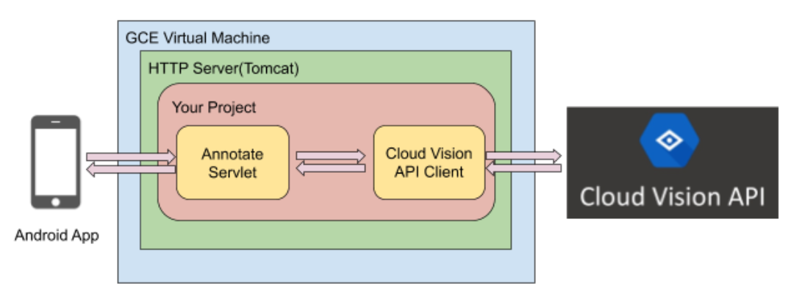
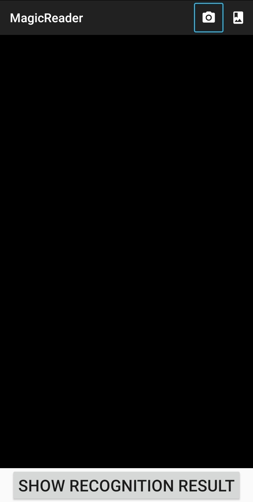
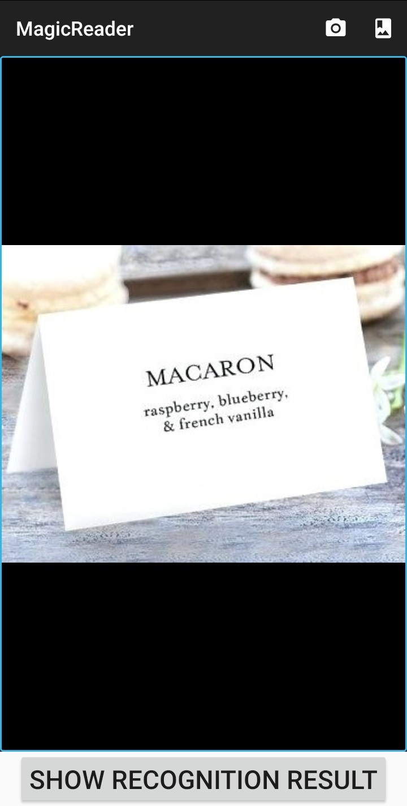
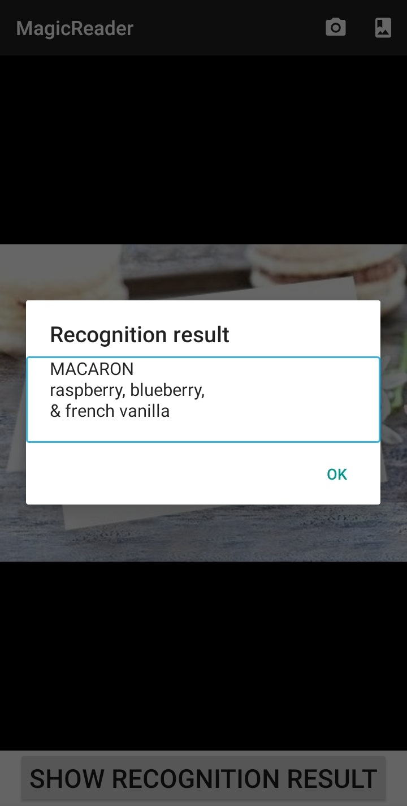

# MagicReader: A full-stack Android project realizing text recognition from image using Google Cloud Vision API

## Overview
This project builds an Android app that helps blind or visually impaired people extract text information from real-life objects. The app allows users to take camra photos or select gallery images for text recognition and immediately displays the detected text. The mobile UI components are designed to be compatible with any screen reader (e.g., Google Talkback) to improve the accessibility of the target users. The core functionality is supported by the optical character recognition (OCR) service provided through Google Cloud Vision APIs. 

This project integrates both a mobile-end design using Android Studio SDK and an Apache Tomcat backend server. The mobile end sends the user selected image to the backend server using HTTP and displays the recognition result received from the backend. The backend server serves as a bridge component between the mobile end and Google Clound Vision service. It handles the HTTP requests received from the mobile end, sends the text recognition request by calling Google Cloud Vision APIs, extracts the text results returned from Google Clound Vision service, and returns the results to the mobile end in HTTP responses. 

|  |
:-------------------------:
| <em>Project diagram</em> |


## Source Code and Usage
* [Android](Android) - mobile end <br />
    - Fill the field `UPLOAD_HTTP_URL` in `com.example.MagicReader.MainActivity` with your backend server URL (with `/annotate` as the endpoint):
  ```Java
  private static final String UPLOAD_HTTP_URL = "http://<Your server IP address>:<port>/annotate";
  ```
* [magicreader](magicreader) - Apache Tomcat backend server (can be deployed onto Google Cloud Platform)


## Demo
 |  | 
:-------------------------:|:-------------------------:|:-------------------------:
<em>Main UI</em>  |  <em>Image selected</em>  |  <em>Recognition result displayed</em>


